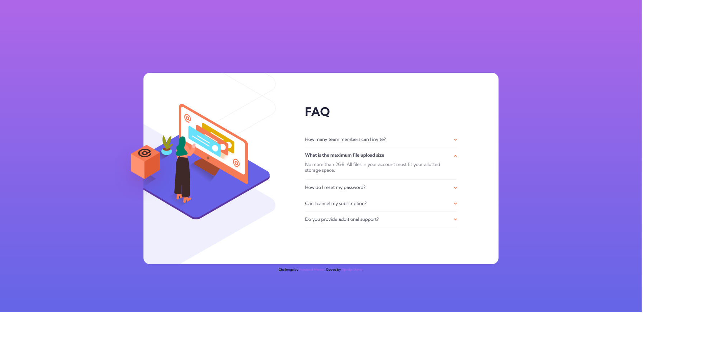

# Frontend Mentor - FAQ accordion card solution

This is a solution to the [FAQ accordion card challenge on Frontend Mentor](https://www.frontendmentor.io/challenges/faq-accordion-card-XlyjD0Oam).

## Table of contents

- [Overview](#overview)
  - [The challenge](#the-challenge)
  - [Screenshot](#screenshot)
  - [Links](#links)
- [My process](#my-process)
  - [Built with](#built-with)
  - [What I learned](#what-i-learned)
  - [Continued development](#continued-development)
  - [Useful resources](#useful-resources)
- [Author](#author)
- [Acknowledgments](#acknowledgments)

**Note: Delete this note and update the table of contents based on what sections you keep.**

## Overview

### The challenge

Users should be able to:

- View the optimal layout for the component depending on their device's screen size
- See hover states for all interactive elements on the page
- Hide/Show the answer to a question when the question is clicked

### Screenshot



### Links

- Solution URL: [Add solution URL here](https://your-solution-url.com)
- Live Site URL: [https://djokaras.github.io/FAQ-accordion-card/](https://djokaras.github.io/FAQ-accordion-card/)

## My process

Started with mobile first approach. In hindsight should have worked on desktop and mobile at the same time, as it was tricky later to do only desktop. Had some issues with reponsive images, should learn more of that.

### Built with

- Semantic HTML5 markup
- CSS custom properties
- Flexbox
- Mobile-first workflow

### What I learned

```css
/* JavaScript toggle class for opening accordion */

.active .question {
	font-weight: 700;
}

.active svg {
	transform: rotate(180deg);
	transition: all 0.3s;
}

.active .bottom-part {
	display: block;
}
```

```js

// Proud of my first JS project code

for (let i = 0; i < topPart.length; i++) {
	topPart[i].addEventListener(`click`, function () {
		for (let l = 0; l < card.length; l++) {
			if (card[l].classList.contains(`active`)) {
				card[l].classList.remove(`active`);
			}
		}
		card[i].classList.add(`active`);
	});
}

};
```

### Continued development

I need to learn about picture tags and to implement responsive images via that tag and not to hide show classes.

### What I learned

Creating classes to be used in JS.
Absolute positioning.

### Useful resources

- [https://www.youtube.com/watch?v=sr94O6Y5NEA&list=WL&index=2&t=238s&ab_channel=CoderCoder](https://www.youtube.com/watch?v=sr94O6Y5NEA&list=WL&index=2&t=238s&ab_channel=CoderCoder) - This helped me on mindset and how to approach the project. Watched her tutorial, than I've coded on my own so the solution would be mine and not just copy/paste.
-

## Author

- Website - [Djordje Stevic](https://github.com/Djokaras)
- Frontend Mentor - [https://www.frontendmentor.io/profile/Djokaras](https://www.frontendmentor.io/profile/Djokaras)

## Acknowledgments

https://github.com/kens-visuals

His way of organizing github inspired to work on all of the projects.
